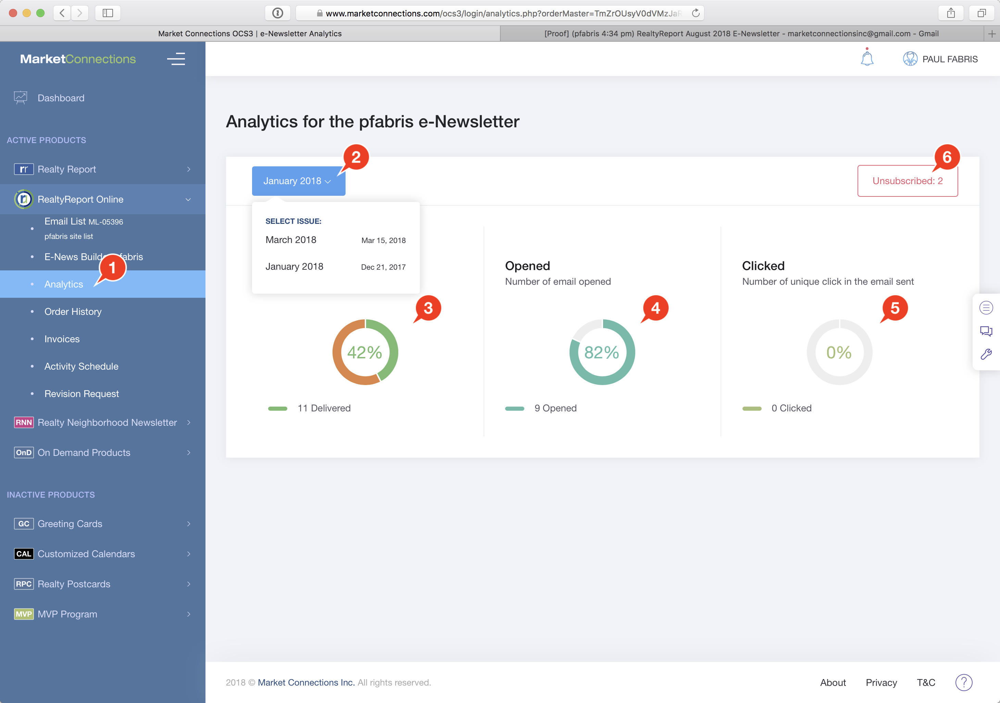

# Analytics

E-Newsletter analytics let you examine how many newsletters were delivered, opened and how many click-throughs to the landing page occurred.

1. Click on the **Analytics** link in the NavBar under RealtyReport Online.
2. Select the Issue you want to review.
3. Number of Deliveries is broken up between successful deliveries \(shown in green\) and failed deliveries \(bounces\) shown in brown.
4. Opened shows, of the number of successful deliveries, how many emails were actually viewed by recipients. This is not a perfect metric - email programs routinely block the collecting of this kind of data.
5. Clicks shows how many times an individual user clicked on a link in the e-Newsletter.
6. Unsubscribes shows how many records in your Email List are currently marked as Unsubscribed.

