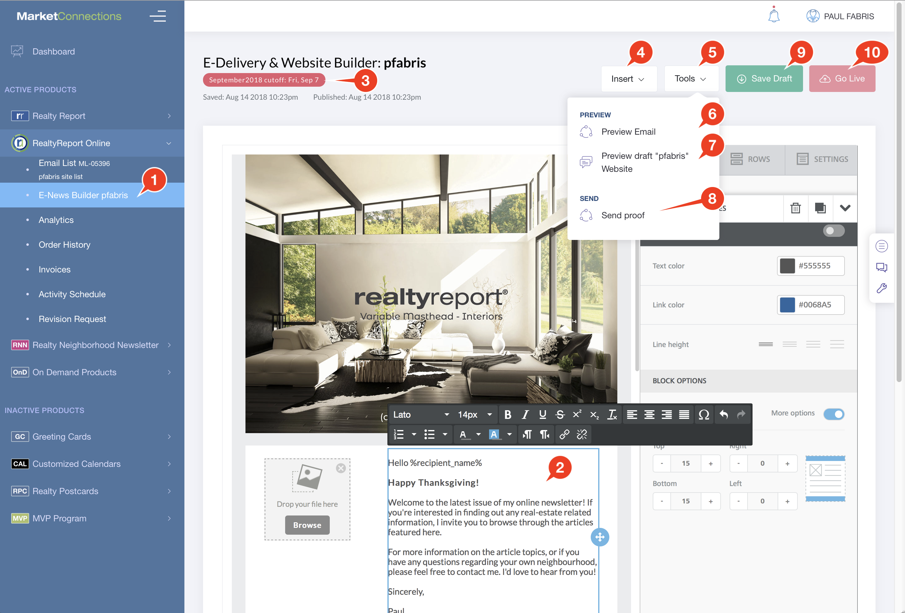

# E-News Builder: Edit Greeting Message

You can customize the the Greeting Message every month to make sure your e-Newsletter is up to date and has the personal touch. Or you can decide on a standard message that works all the time and leave it alone -- it's your choice.

## Screencast



## How-To Edit your E-Newsletter

1. Under your **RealtyReport Online** Product in the NavBar, click on the **E-News Builder** link.
2. **Editing** the message is easy -- simply click on the Greeting Message content block and type your message.
   * **Style** Use the Text Style tools to customize the way the font looks.
   * You can add clickable **Links** by clicking the Link icon in the toolbar.
   * Don't change or remove the `%recipient_name%` variable -- this is substituted for the Name of the recipient in your Email Mailing List when we run e-Delivery. If you don't have a First Name or a Full Name for your email list, the Email will just say "Hello"
3. The Deadline is shown at the top. Make changes before this date to ensure your changes go into the next e-Delivery.
4. The **Insert** menu allows you to add new sections to the Email, including 1 column and 2-column Real Estate Listing blocks.
5. The **Tools** Menu allows you to do several important things:
6. Preview what your email will look like in a Desktop Email client and on a Mobile device
7. Preview what your Website Landing Page will look like with the current changes.
8. Email yourself a Proof of the E-Delivery Email.
9. **Save Draft:** Click the `Save Draft` button to save your work as you go. If you accidentally go to another page, or close the Browser window, your work will be lost.
   * **Undo**: If you make a change you don't like, you can `Refresh` your browser window to go back to the last Save. **All changes** you made after the last time you clicked Save Draft will be gone!
10. **Important: Go Live**: When you're happy with your changes, click the `Go Live` button. You **must** Go Live if you want your saved changes to appear in the next e-Delivery email.

