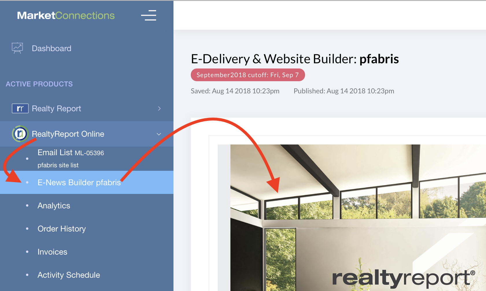

# E-News Builder Overview

## About the E-News Builder 

The E-News Builder allows you to review and edit your **realtyreport**® Online e-Newsletter.  It  controls both the e-Newsletter that is mailed to the clients on your Email List, and the Landing Page Website, where recipients actually read the articles.

## Common Tasks 

Here's how you perform some common tasks:

* [Edit the Greeting Message](https://ocshelp.marketconnections.com/e-news-builder/e-news-builder-edit-greeting-message.html) - Watch the [Vimeo Screencast](https://vimeo.com/253806553)
* [Upload a new Photo or Logo](https://ocshelp.marketconnections.com/e-news-builder/upload-an-image.html) - Watch the [Vimeo Screencast](https://vimeo.com/253812114)
* [Modify your Contact Information](https://ocshelp.marketconnections.com/e-news-builder/modify-contact-info.html) on both the e-Newsletter and the Landing Page Website - Watch the [Screencast](https://vimeo.com/253822009)
* Edit a [Realty Listing Template](https://ocshelp.marketconnections.com/e-news-builder/e-news-builder-real-estate-listings.html)
* Add a [Custom Rows and Content](https://ocshelp.marketconnections.com/e-news-builder/e-news-builder-add-real-estate-listings-and-custom-rows.html) on your e-Newsletter - Watch the [Screencast](https://vimeo.com/253832797)

## FAQ 

Read our [Frequently Asked Questions](https://ocshelp.marketconnections.com/e-news-builder/e-news-faq.html)

