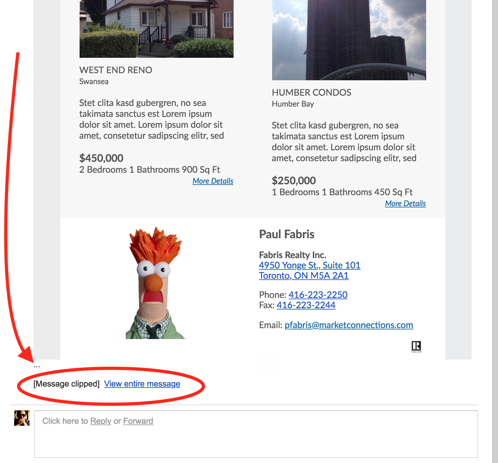

# Gmail Truncation Issue

### Gmail Truncates Long Emails 

One aspect of e-Delivery that Market Connections does not have control over is that Google's popular Gmail service truncates email messages that contain more than 102KiloBytes \(KB\) of data. The full message is only viewable when someone clicks a "View Entire Message..." link that Gmail appends to the bottom of the message.

The 102KB amount has nothing to do with images or videos -- it refers to the data of the html markup code in the e-Newsletter.

The E-News Builder will warn you if there is more than 102KB of data in your e-Newsletter. It generates a warning when you click the `Save Draft` button. It's up to you to decide what to cut to get below 102KB. 

We have designed the new realtyreport Online e-Newsletter so that it can contain all these following elements without exceeding 102KB:

* Masthead \(Variable or Custom\)
* Greeting Message with 2 or 3 short paragraphs of text.
* 4 Featured Articles
* 2 Listings rows containing up to 3 Listings
* A Local Events row with a few sentences worth of text
* The Contact Info row with a your Name, Address, Phone Email and Website, and Logo
* A row of Social Media Icons
* Standard Disclaimer
* The Unsubscribe, and Policy links at the bottom.

If you need to put more rows of Listings, or type in a very long Greeting Nessage you can do so, but you may need to remove other elements to avoid this truncation.

If you do not use Listings and do not have any custom Content blocks, you probably will not run afoul of this problem.

#### Another alternative 

Instead of removing Listings or other custom content, you can send us a request to reduce the number of Featured Articles to 3 or 2 or even 1, if you prefer.

#### Risks: 

If choose not to reduce the size of your e-Newsletter, you must expect that all recipients who use Gmail will **not see the bottom** of your e-mail message. 

That means they may not see your contact info, and they may not see the **disclaimer** and **Unsubscribe**links. In very worst case scenarios, your Contact Info may be clipped.

