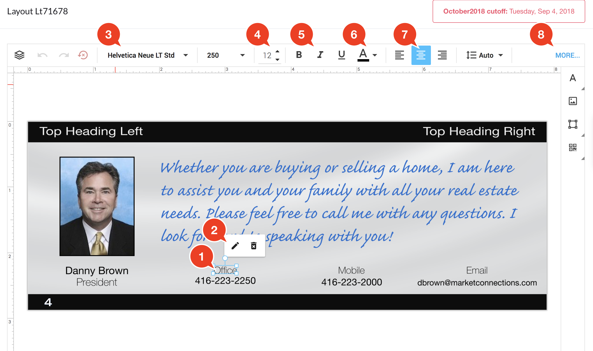

# Layout Editor: Editing Text Boxes

The [Layout Editor](https://marketconnections.gitbooks.io/ocs3help/content/v/071549b37967e0963bc353d63fc707ad9f08d327/layouteditor.html)'s Standard text boxes allow you to quickly type in text and go. They support different fonts, colours, sizes, styles and text-alignments, but the formatting applies to the entire text box.

1. Double-click a text box to display the edit bubble.
2. Or, click the Pencil icon to show the edit bubble. Click the `x` button in the edit bubble when you're done editing the text. If you pause a second, you'll see your text live updated on the layout editor.
3. After you've closed the edit bubble, but while the text box is still selected, you will see the formatting bar appear on the top of the layout editor. You can change the Font typeface.
4. Change the font size.
5. Bold, italicize and underline the text.
6. Change the colour of the text.
7. Change the alignment.
8. Click the "More..." button to access advanced editing features, like drop-shadows.

#### Changing the text box position 

**Click & Drag**:You can click and drag a box to move it on the canvas. Note: some boxes are restricted to up/down or left/right only movement.

**Nudging**:You can also move a box by "nudging" it. When the box is selected \(not while editing text\), you can use the up/down/left/right arrows on your keyboard to "nudge" the position of the box.

