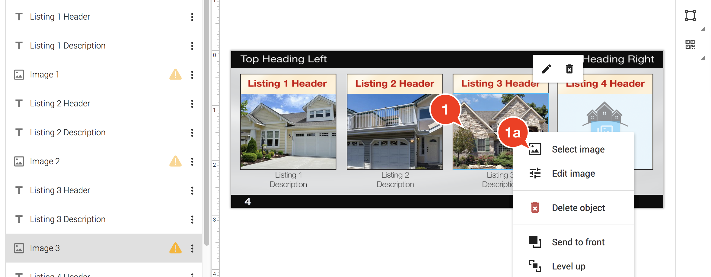
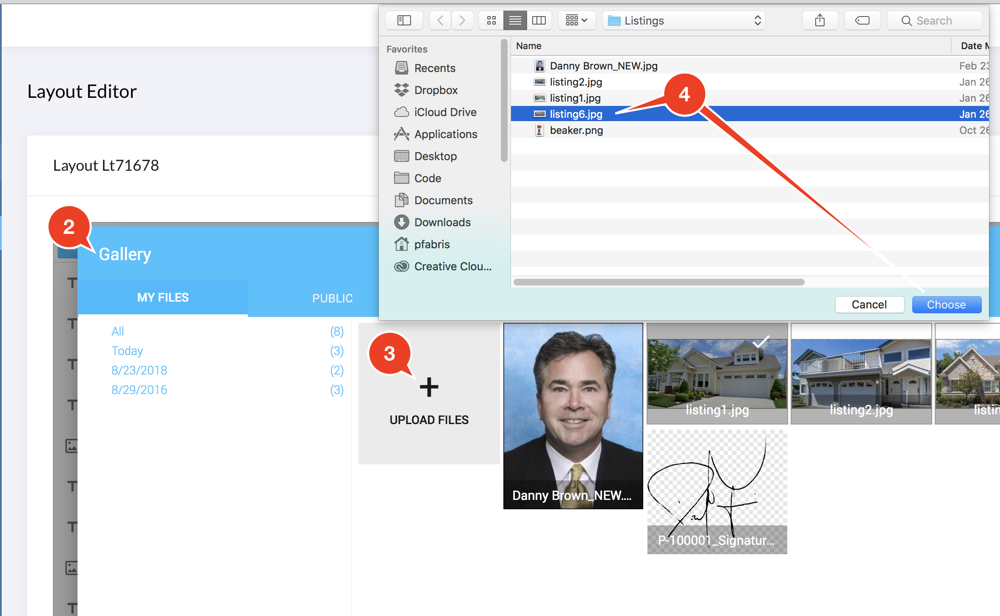

# Layout Editor - Image Boxes

## Upload a new image to an image box:

1. Double-click on the image box \(or right-click and choose "Select Image"\)
2. The Image Gallery dialog box appears.
3. Click the "+ Upload Files" button.
4. A standard Mac or Windows file dialog appears.  Locate a JPEG or PNG image on your computer and click the "Choose" or "Open" button.
5. The image will take a moment to upload into the Image Gallery.  
6. Double-click on an image to insert it into the current Image box


In the Image Gallery, you can drag and drop multiple files from your computer onto the " + Upload Images" box.  This will batch upload several pictures at once.


## To change an existing Image

1. Double-click on the image box.
2. The Image Gallery appears.
3. Locate the image in the Image Gallery and **double click** on it. This will insert the selected image into the image box.


You can also **right-click** on an **image box,** then choose the "Select Image" command


