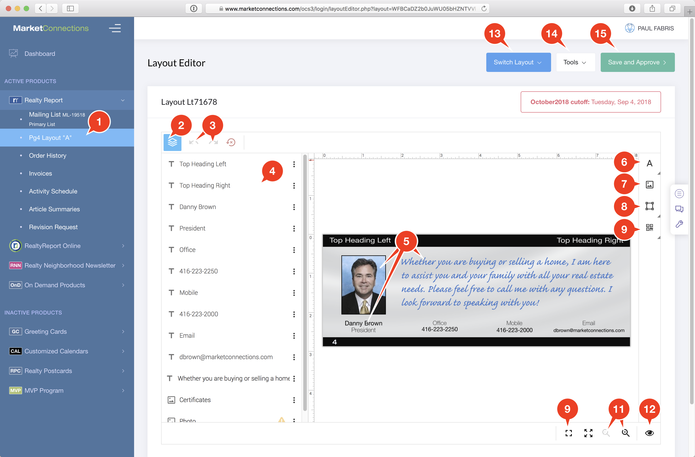

# Layout Editor Overview

The Layout Editor allows you to edit aspects of your print layout directly in your web browser.  You can

* Upload new photos of yourself, logos, or real estate listings
* Modify the text, change the colour, the font size.
* Move print elements around on the canvas
* Add new elements, like QR barcodes, boxes, images and backgrounds.

Watch this 3 minute video to get the basics. Turn on `CC` \(closed captioning\) to see instructional subtitles.



## Basic Controls

1. Click on the Pg4 Layout "A" link on the sidebar. This may also show up as "Pg1/Pg4", or "Envelope", depending on how your Layout was setup.
2. The Layers Pallete can be toggled on and off using the Toggle button. Hiding the layers allows you to enlarge the view of the Canvas
3. The Undo and Redo buttons allow you to quickly undo mistakes. You can undo multiple actions from the current editing session.
4. The Layers Pallete allows you to edit text directly. There are submenu options for each layer that allow you to duplicate elements, change the alignment of objects on the canvas, and re-order the object layer stacking.
5. The Canvas allows you to directly edit any element. Just click on a Text, Rich-Text, or Image element. 
   1. Text boxes: click on a text element and click the Pencil icon to edit the text. Move or resize the element by clicking and dragging the element, or dragging one of the resize handlers on the 4 corners of the element. Above the Canvas, the Text toolbar will appear, allowing you to change all elements of the Font, including the colour, size, font, weight and many other options.
   2. Rich-Text boxes: these boxes open in a new editing window, and allow you to highlight and style individual words. You can also modify paragraph settings like alignment, and "leading" which is the space between lines.
   3. Image boxes: these boxes allow you to resize photos. You can right-click on an Image box to select the "Select Image" to load the Image Gallery and upload a new image into the existing Image box frame. When you click on an Image box, the toolbar above the Canvas changes to allow you to modify elements of the image, including borders, backgrounds, drop shadows, and other settings.
6. Add a new Text Box
7. Add a new Image Box
8. Add a new Shape to the canvas - boxes, circles, lines can be added, resized, and styled using the toolbar above the canvas.
9. Add a Barcode to the canvas. You can add simple or QR barcodes.  QR barcodes allow you to add contact information, or URLs to a Canvas that can be scanned by smartphones.
10. Enlarge or reduce the Layout Editor to occupy the whole browser window.
11. Zoom in and out of the Canvas
12. Display Grid Lines on the Canvas, and turn the "Snap Lines" on or off. Snap Lines make it easy to align boxes on the Canvas to other boxes.
13. Switch Layout allows you to change your Page 4 layout to use
    1. 4-Listings layout: This layout template is optimized for 4 Real Estate Listings with Images, Headings and short Descriptions.
    2. Certificate/Note layout: this layout template has your Photo and a Note field with a message you can customize.
    3. Blank: A completely blank layout, where you can do as you like.
14. Tools
    1. Save: this will save whatever work you have done in the current session, without approving it for production.  You can come back later to finish your work. The Save button prevents you from losing changes if you accidentally close the browser.
    2. Reload Last Save: if you've made several changes, but want to simply revert back to the last time you saved your Layout, choose this option.
15. Save and Approve: This function is critical. You must click this button in order for your changes to go into production. If you don't click this button, whatever changes you made will not make it into the next issue.

