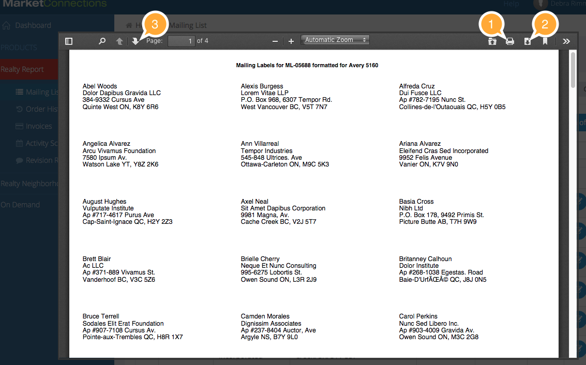
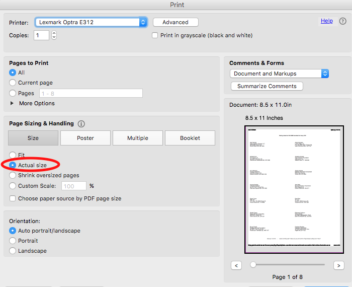

# Generate and Print Mailing Labels

You can create Mailing Labels from your records in the following Avery formats:

* [Avery 5160](http://www.avery.com/avery/en_us/Templates-%26-Software/Templates/Labels/Address-Labels/Address-Label-30-per-sheet-_-1-x-2-58_Microsoft-Word.htm) \(30 labels per sheet, 1 x 2 5/8 inches\)
* [Avery 5162](http://www.avery.com/avery/en_us/Templates-%26-Software/Templates/Labels/Address-Labels/Address-Label-14-per-sheet_Microsoft-Word.htm) \(14 labels per sheet, 1-1/3 x 4 inches\)

To generate labels for your entire mailing list:

1. Pull down the **Tools** menu
2. Choose **GENERATE 5160 LABELS** or **GENERATE 5162 LABELS**

\(You can generate labels for selected records by ticking the Select Checkbox before performing the steps above\)

This will open up a new window with your PDF in it.

1. To Print, Click the PRINT button.
2. To Download the PDF to your computer, click the DOWNLOAD button. The PDF will download to your computer's Downloads folder.
3. To flip pages, or zoom, click the zoom and Page buttons. 

### IMPORTANT - Shrink to Fit

Turn off "Shrink to Fit" options when you print. These PDFs should be printed at 100%, or else the labels 

