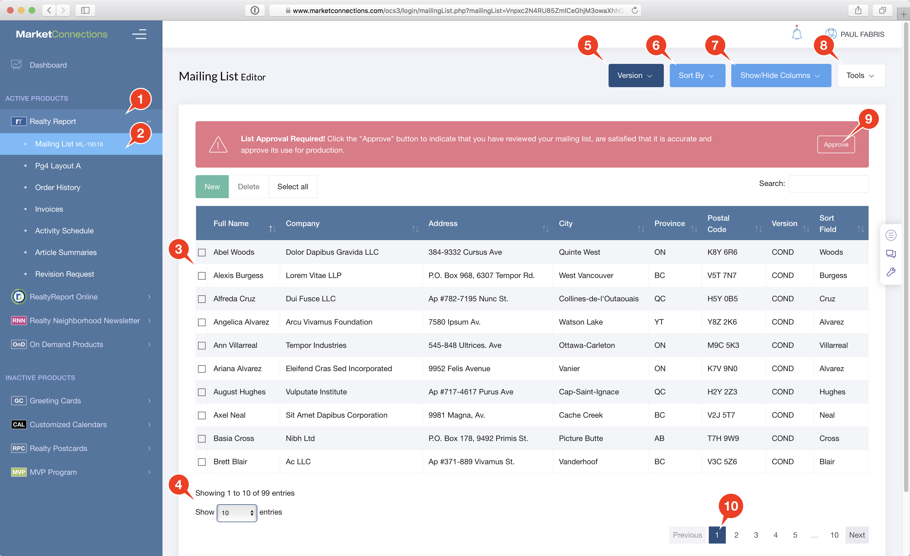

# Overview

We have Help pages for each of the major functions, like [Edit a List Record](edit-a-list-record.md) and [Delete records](delete-one-or-more-records.md). Check the Table of Contents. Below is an overview of all the controls.

## Basic Controls

The List Editor shows you 25 records from your Mailing or Email list on a page. It shows them to you in a table view, much like a spreadsheet.

1. Click on a **Product** in the **NavBar** for which you are taking Mailing Services or E-Delivery.
2. The Product NavBar, in this case Realty Report, will expand and show you the Services submenu.  Click on the **Mailing List** link. 
3. **New Record** button - click to add a record to the list.
4. **Delete Record** button - works with the selection checkboxes. Select one or more records and click the Delete button.
5. **Select All** button. Selects all the records shown on the current page.
6. Sort buttons are shown for every column.  Click on a column header to sort the list on that column. Click a second time to reverse-sort.
7. Columns are resizable. Hover your mouse between two columns headers and you'll see your mouse cursor change into a "resize" cursor. At that point, click and drag left and right to resize the column width.
8. **Search** for a record by typing into the Search field. The table will update live as you type.  All displayed columns are searched, so you can search on a recipient's Name, and Address or a City.

## Other Controls

1. Click on a **Product** in the **NavBar** for which you are taking Mailing Services or E-Delivery.
2. The Product NavBar, in this case Realty Report, will expand and show you the Services submen.  Click on the **MailingList** link. 
3. Your Mailing List will load on the main screen in a table view with columns for each field. By default, 25 records appear on the page.
4. Control how many records appear on the page by changing the **Show Entries** menu. The total number of records is shown just above the menu. You can display **All** your records on one page if you like. The **Page Navigator** \(\#10\) allows you to navigate the pages.
5. The **Version** menu allows you to bulk-edit the Version assigned to multiple records at once.
6. The **Sort By** menu allows you to sort by any column, even hidden once. Click on a column twice to reverse-sort the table.
7. The **Show/Hide Columns** menu allows you to customize which columns appear in the table.
8. The **Tools** menu allows you to 
   1. Print Avery 5160 or 5162 size labels from your mailing list
   2. Export your mailing list to a CSV \(comma-separated values\) file, which you can easily open in Excel or import into another database application.
   3. Export your mailing list records to the WiseAgent Real-Estate CRM \(requires a WiseAgent Account\).
   4. Print out your mailing list in an optimized view.
9. The first time you view your list, you will need to approve it for production.  We cannot go to production with your mailing list or email list without you verifying that the records are correctly setup, and that the record count is correct, and the data is accurate. To approve your list, after you've reviewed it, click the **Approve** button.
10. The **Page Navigator** allows you to go from page to page in your mailing list. The Pages are arranged according to the column you are sorting by. The number of Pages shown depends on how many records you selected in the **Show Entries** menu \(\#4\)

