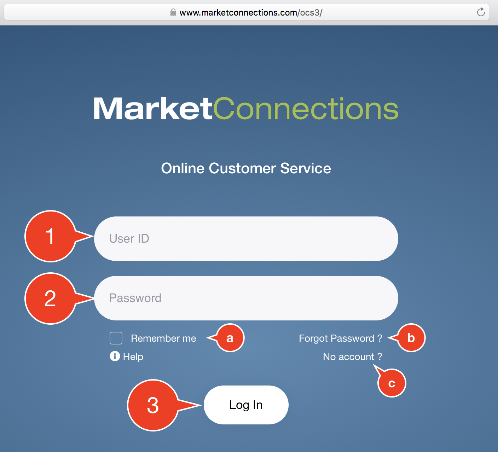

# How to Login to OCS

## Existing Users

You have a Login ID and have already setup a Password.  Go to the [Login Page](https://www.marketconnections.com/ocs3) and

1. Enter your User ID
2. Enter your Password
3. Click the Login button

* a\) The Remember Me checkbox allows you to save your User ID so you don't have to enter it next time.
* b\) Click `Forgot Password?` if you've forgotten your password. This will take you through the [Password Reset](password-reset.md) function.
* c\) The `No Account?` link displays our contact information.

## New Users

We need to set you up _before_ you can login. If you haven't received a Setup Email from Customer Service, please [email us](mailto:customerservice@marketconnections.com), or call us: +1 \(888\) 659-4755.

