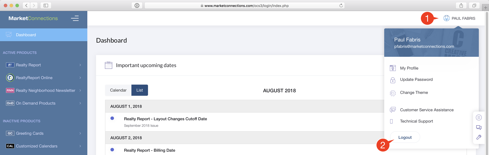

# Logout of OCS

It's a good idea to logout of OCS when you are finished what you're working on. Logging out prevents anyone who may have access to your computer from making unauthorized changes.

You'll be automatically logged out after 60 minutes.

Closing the browser window, or quitting your browser, does not execute a logout.

#### To Logout:

1. Click on the Profile menu
2. Click the `Logout` button

