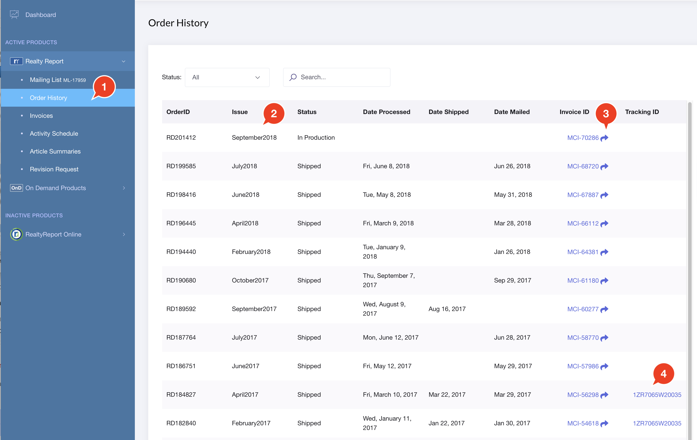

# Order History

Here, you can review your past orders and the status of your current orders.

1. Click the Order History link in the NavBar
2. Your orders are listed \(most frequent at the top\) alongside the Production Status. Note the "**Shipped**" status refers to the fact that an order can have shipped via UPS, or shipped to the Post Office for Mail Delivery.
3. The invoice for your order can be seen by clicking on the `Invoice ID` button.
4. If you requested office copies, you will see the UPS Tracking Number for your order.

