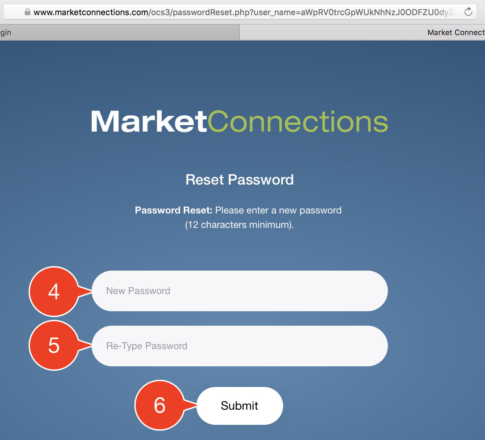

# Password Reset

On the main [Login Page](https://www.marketconnections.com/ocs3), click the `Forgot Password?` link. The screen will change to show only the LoginID field.

1. Type in your Login ID. \(if you forgot your Login ID, you'll need to call us\)
2. Click the `Submit` button.
3. A Password Reset email will be sent to the Email Address we have on file for you. When you recieve it, click on the `Reset Password` button.
4. You will be taken to the Step 2 page. Here, you can enter a _**new**_ password. It must be at least 12 characters long.
5. You must enter your password a second time to confirm it.
6. Click the `Submit` button to finish the process.  

You can now go to the Login Page with your new password.

