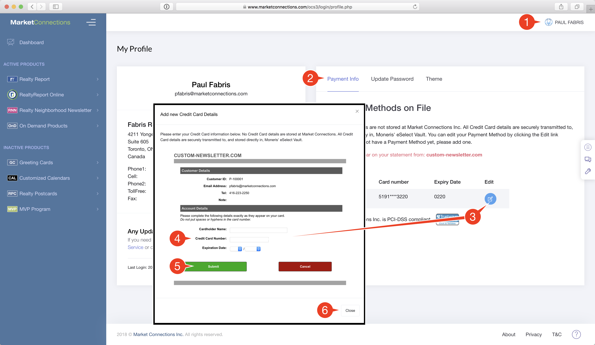

# Profile, Billing & Password

The Profile Page allows you to change your Password, update your payment information, and review your customer profile.

## To view your Profile and change your password

1. Go to the Profile Page by clicking on the Profile Menu.
2. Your Name and primary Email address - to make changes, please contact Customer Service
3. Your current Shipping Address - to make changes, please contact Customer Service
4. Your Phone Numbers - to make changes, please contact Customer Service.
5. To update your Password, click the **Update Password** tab
6. Enter your **current** password
7. Enter your **new** password - it must be at least 12 characters long
8. Type your **new** password in again to confirm it
9. Click the `Change Password` button

## To change your Payment Information

1. Go to the Profile Page by clicking on the Profile Menu
2. Click on the Payment Info tab. You will see a list of all the Payment Methods you have on file with us.
3. Click the `Edit` button beside the Payment Method you want to update.
4. A popup window will appear. Enter your Cardholder Name, Credit Card Number and Expiry Date in the fields shown.
5. Click **`Submit`** to process your changes. Your card number and expiry date will be validated. If there are errors, you will be shown the error and what to correct.
6. If the updated information is accepted, you'll see a response indicating Success. You can then click the `Close` button.

