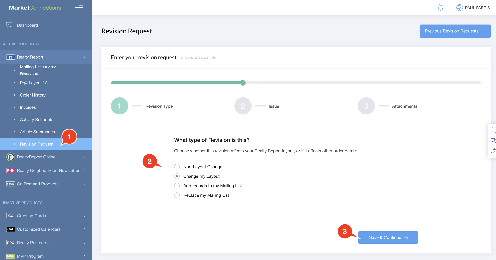
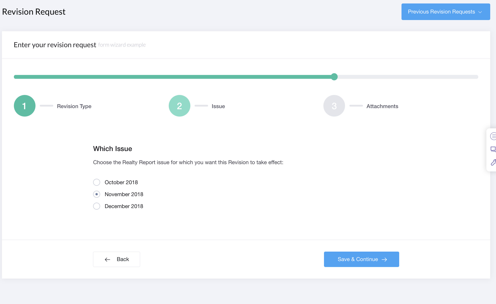
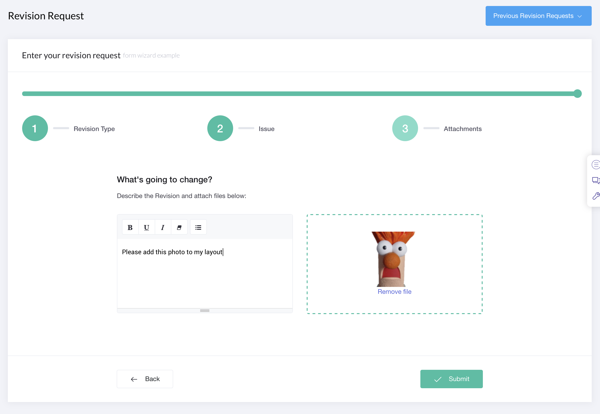

# Revision Request

You can request changes to your order by submitting a Revision Request. Use this method instead of emailing us your changes for faster turnaround, and more accurate data entry.















1. Click on the REVISION REQUEST in the NavBar.
2. Choose the **Type of Revision**
   1. **Change My Layout**: if your changes will affect your newlsetter layout, for instance your office is moving, or you want to change the greeting message
   2. **Non-Layout Changes**: these include changes to your Order Quantity, your shipping address.
   3. **Add records to Mailing List**: if you have a data file you wish to add to your Mailing List
   4. **Replace my Mailing List**: if you have a data file you wish to use instead of your current Mailing List, we can completely replace the mailing list with the data file you upload.
3. Click **`Save and Continue`** to go to the next step
4. **Which Issue?**
   1. The next 3 upcoming issues are listed. Select which one you want your changes to take effect. If you've missed the cutoff for the current issue, it will not be listed here.
5. Click **`Save and Continue`** to go to the next step
6. **What's going to change?** Enter the details of your changes.
   1. You can style and organize the changes into bullet points.
   2. You can drag and drop, or browse to attach files to your revision. You can upload Images or XLS, CSV and TXT data files, or Word documents. You can drag and drop multiple files at once.
7. Click the **`Submit`** button. 
8. We will respond to your revision request if we require further details. 

If you have submitted layout changes or mailing list changes, we will require you to proof your layout and approve your mailing list.

